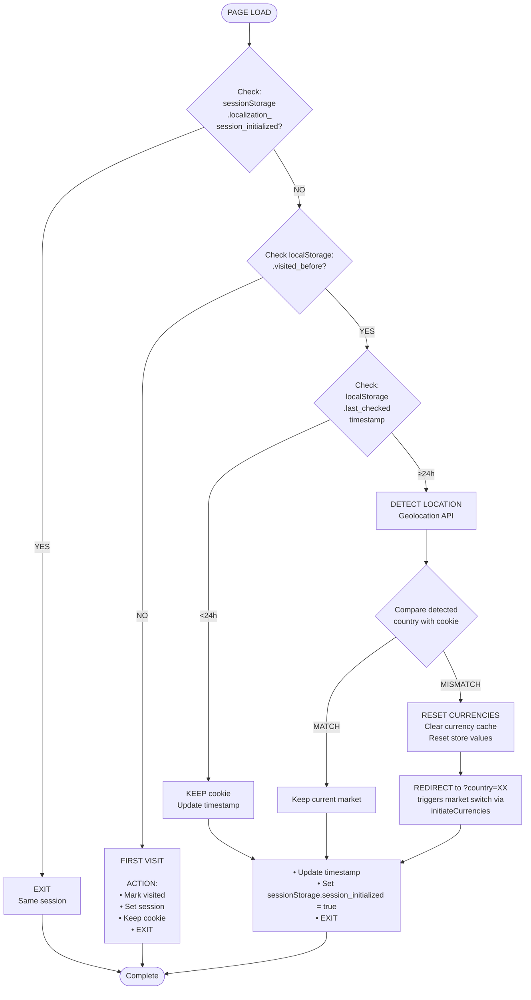

# Localization Freshener

Smart geolocation-based market switching system that detects user location changes and redirects to the appropriate market.

### Problem

When Shopify sets the localization cookie (1-year expiry), it's based on the user's initial IP location. If a user travels to a different country, they're still trapped in the original market with different prices. We need to:

1. **Not refresh for first-time visitors** (avoid unnecessary API calls and redirects)
2. **Keep consistent market for active sessions** (prevent disruption mid-browse)
3. **Detect location changes after 24h+ breaks** (for returning users who may have traveled)
4. **Handle market switching ourselves** (Shopify backend recalculation is unreliable)

### Solution

Multi-layer detection and geolocation system:

1. **Session Storage** → Detects same browser tab (sessionStorage cleared on tab close)
2. **localStorage.visited_before** → Distinguishes first-time from returning users
3. **localStorage.last_checked + 24h timestamp** → Determines if location check needed
4. **Geolocation API** → Detects user's actual country via IP
5. **Smart Redirect** → Redirects to correct market using `?country=XX` parameter

### Flow Diagram

```
┌────────────────────────────────────────────────────────────┐
│                    PAGE LOAD                               │
└────────────────┬───────────────────────────────────────────┘


```

### User Scenarios

| Scenario | Session Check | Visited Check | Timestamp Check | Geolocation | Action | Redirect? |
|----------|---------------|---------------|-----------------|-------------|--------|-----------|
| Brand new user | NO | NO | (skipped) | (skipped) | Mark visited, keep cookie | ❌ No |
| Same session <5 min | YES | (skipped) | (skipped) | (skipped) | Exit immediately | ❌ No |
| New tab, same browser <24h | NO | YES | <24h | (skipped) | Keep cookie | ❌ No |
| New tab, same browser >24h, same location | NO | YES | >=24h | Match | Keep cookie | ❌ No |
| User travels to different country | NO | YES | >=24h | Mismatch | Redirect to new market | ✅ Yes |

### Implementation Files

- **`localization/localization-freshener.ts`** - Main orchestrator
- **`localization/localization-storage.ts`** - localStorage helpers and constants
- **`localization/geolocation-detector.ts`** - IP-based country detection with multiple fallbacks
- **`storage/get-cookie.ts`** - Cookie utilities (includes `cookieExists`)
- **`storage/get-session.ts`** - Session storage utilities
- **`storage/remove-cookie.ts`** - Cookie removal utility

### Storage Keys

```typescript
LOCALIZATION_STORAGE_KEYS = {
  VISITED_BEFORE: 'localization_visited_before',           // localStorage
  LAST_CHECKED: 'localization_last_checked',               // localStorage
  SESSION_INITIALIZED: 'localization_session_initialized'  // sessionStorage
}
```

### Geolocation Detection

The system uses multiple fallback methods to detect user location:

1. **Cloudflare Headers** (if available) - Fastest, no external API call
2. **ipapi.co** - Free tier: 1000 requests/day, no API key required
3. **ip-api.com** - Free tier: 45 requests/minute, no API key required

Detection only runs when the 24-hour check interval has passed, minimizing API usage.

### Country Handling

Detected country codes are passed directly to Shopify via the `?country=XX` parameter. Shopify handles all country-to-market mapping and fallbacks automatically, so we don't need to maintain our own mapping logic.

### Usage

In your main head component:

```typescript
import { localizationFreshener } from '$lib/utils/browser/localization/localization-freshener.js';

export const mainHead = async () => {
  await localizationFreshener();
  // ... other init code
}
```

The function is called on every page load and automatically handles all scenarios. It's async because it may need to call geolocation APIs.

### How Market Switching Works

When a location mismatch is detected:

1. User's actual country is detected via geolocation API
2. Country is normalized to a supported market (e.g., DE → LT)
3. If different from current cookie, redirect to: `currentUrl?country=XX`
4. `initiateCurrencies()` detects the `?country=` parameter
5. Updates stores: `displayCurrency`, `marketCurrency`, `localization`
6. Removes `?country=` parameter from URL
7. Shopify's market switching happens automatically via cookie updates
